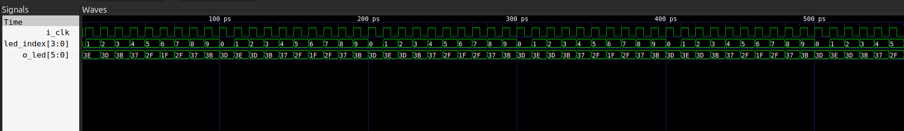

Steps to recreate-
1. Run the make file
2. The executable file led_sim shows the o_led values based on the led.cpp testbech.
3. Use GTKWave to run the ledtrace.vcd file
4. To perform formal verification compile the led.v file using Verilator and then run the sby file using the command
 sby -f led.sby
 and ensure "successful proof by k-induction"